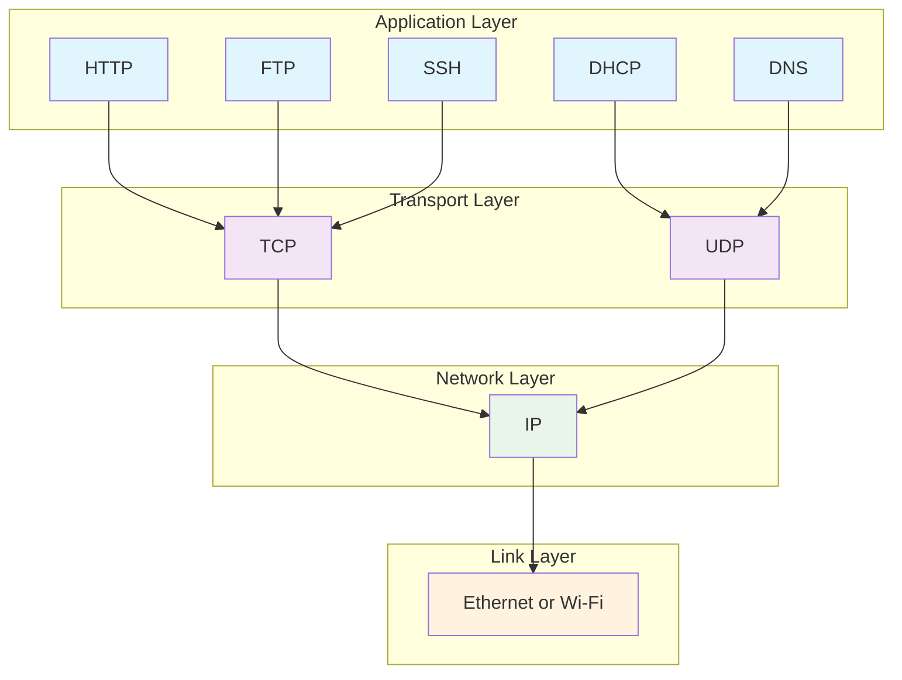

#map
个思路是等你有需求时再去找相应的插件/教程，比如说我现在只是轻度使用，用得比较多的就是admonition（好看的文本框，类似notion的callout）、advanced tables（用tab和enter快速创建表格）、auto link title（自动补全链接标题）、daily notes、easy typing（中英文间加空格，功能性字符无需切换输入法），再加上emoji和/图标快捷输入和双向链接

试试同步再试试
我是PC端
[[Android手机远程同步]]
[[PC远程同步]]